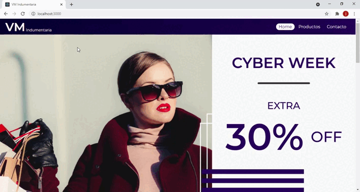

# VM Indumentaria

​VM Indumentaria es un e-commerce para venta de ropa, tal como pantalones, remeras, camisas o zapatillas.​

Cuenta con​:

- Filtro por categorías: Tomando las categorías se generan filtros de productos
- Vistas de listas de productos: Vista general de productos con foto y detalles mínimos
- Vista de detalles: Vista con todos los detalles del producto​
- Carrito de compra: Vista para visualizar todos los productos seleccionados y finalizar la compra.
- Vista de contacto: Vista con formulario para contacto con el negocio.

## Instalación

1. Forkeá y cloná el repositorio
​
2. Parado en la raíz del proyecto corré el comando 
​
   
```
   npm install
```
​
para instalar todas las dependecias del proyecto.
​

3. Usá:
​
  ```
   npm start
  ```

​para correr el proyecto, que estará disponible en http://localhost:3000
​
## Dependencias

- Uso de [React Router](https://github.com/remix-run/react-router) para la navegación.
- Uso de [Firebase](https://www.npmjs.com/package/firebase) para almacenamiento de productos y ordenes de compra.
- Uso de [Sweet Alert](https://sweetalert2.github.io/) para alertas estilizadas dentro del flujo de la aplicación. 

## Como funciona


## Autor
​
Joan Manuel Mutti Ferreyra
​

2021 - Curso de React en CoderHouse